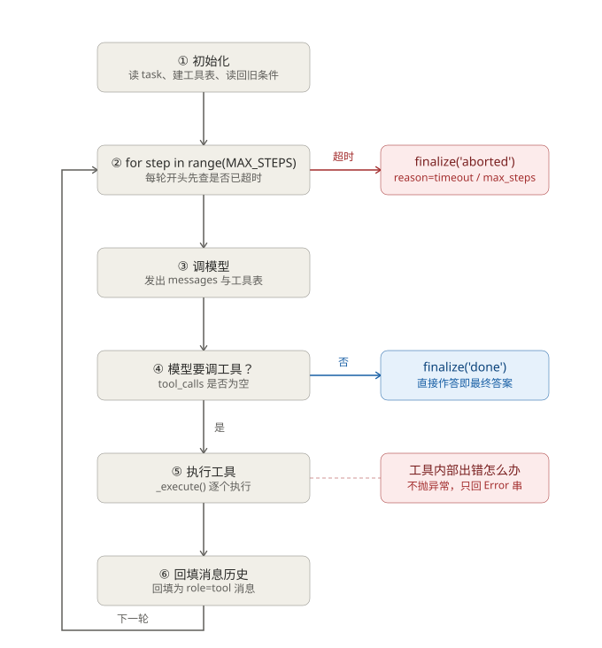
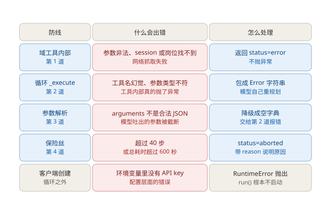

# 实习搜索 Agent 的循环结构介绍

**对应代码**：`scheduler/domain_internship_search.py`
**主要类**：`InternshipSearchAgent`（第 2609 行起）
**文档日期**：2026-09-28

---

## 0. 一句话概括

这个 Agent 是一台**转发机**。它自己不判断「下一步该干什么」，只负责把模型说的话变成工具调用、再把工具的结果变回模型能读的消息，如此往复，直到模型不再要求调工具。

---

## 1. Agent Loop 的本质

### 1.1 三个角色各管什么

| 角色 | 负责 | 不负责 |
|---|---|---|
| 模型 | 决定下一步调哪个工具、传什么参数；决定什么时候收工 | 不亲自执行任何工具 |
| 循环（`run()`） | 转发消息、执行被点名的工具、回填结果、数步数、掐表 | 不做任何业务判断 |
| 工具 | 按参数干活，返回结果或错误信息 | 不知道自己在循环里 |

**核心结论：循环本身没有智能。** 它是一段机械的 `for`，任何「该不该重试」「该不该换个数据源」的判断都发生在模型那一侧。

### 1.2 循环住在哪里

同一份域代码，循环可以住在两个地方，这是两种不同的归属选择：

| | 框架驱动 | 域驱动（当前形态） |
|---|---|---|
| 循环写在哪个文件 | `scheduler_skeleton.py` 的 `AgentLoop` | `domain_internship_search.py` 的 `InternshipSearchAgent` |
| 谁持有消息历史、轨迹、步数 | 框架实例 | 域实例 |
| 换一个域要改什么 | 只换一张工具表 | 重写一个类 |
| 域是否「纯净」 | 纯净（域只是环境） | 不纯净（域 = 环境 + 循环） |

两种形态里，「下一步做什么」都是**模型**决定的；差别只在**循环这个控制结构挂在哪个对象上**。

---

## 2. 主循环流程



### 2.1 逐个节点说明

| 节点 | 代码位置 | 做什么 |
|---|---|---|
| ① 初始化 | `__init__`（2622） | 把 task 原文写进 `DOMAIN_STATE`；读回上次记录的条件；建工具注册表与 schema；初始化 `messages` / `trace` |
| ② 循环头 | `run`（2770–2779） | `for step in range(MAX_STEPS)`；每轮开头先检查总耗时是否超过 `TIMEOUT` |
| ③ 调模型 | `_call_llm`（2709） | 把 `messages` 与工具 schema 一起发给模型，拿回一条 assistant 消息 |
| ④ 判断 | `run`（2787） | 判断 `message.tool_calls` 是否为空 —— 这是循环唯一的正常出口 |
| ⑤ 执行工具 | `_execute`（2721） | 按模型给的工具名去注册表里找函数，执行，把任何异常转成字符串 |
| ⑥ 回填历史 | `run`（2817–2823） | 以 `role="tool"` 把结果塞回 `messages`，`tool_call_id` 与上面的调用配对 |

### 2.2 消息历史长什么样

每一轮循环，`messages` 稳定地按这个节奏增长：

```
[system]    AGENT_SYSTEM_PROMPT
[user]      任务原文
  ── 进入第 1 轮 ──
[assistant] tool_calls: [ search_web(query="data intern", source="linkedin") ]
[tool]      {"status":"ok","postings":[...]}      ← tool_call_id 与上面那条配对
  ── 进入第 2 轮 ──
[assistant] tool_calls: [ fetch_page(url="..."), fetch_page(url="...") ]
[tool]      {"status":"ok","content":"..."}
[tool]      {"status":"ok","content":"..."}
  ── 若干轮之后 ──
[assistant] content: "推荐以下岗位……"             ← 没有 tool_calls，循环结束
```

有一点必须对准：**模型一次可以要求调多个工具**。上面第 2 轮里两个 `fetch_page` 是同一条 assistant 消息带出来的，循环会逐个执行、逐个回填，全部回填完才进入下一轮。所以「步数」数的是**轮数**，不是工具调用次数 —— 这也是为什么 `result` 里 `steps_used` 和 `tool_calls` 是两个不同的字段。

### 2.3 三个出口

| 出口 | 触发位置 | `status` | `reason` |
|---|---|---|---|
| 模型不再要工具 | 节点 ④（2787） | `done` | `None` |
| 超时 | 节点 ②（2774） | `aborted` | `timeout` |
| 步数用尽 | `for` 跑满后（2826） | `aborted` | `max_steps` |

任何一个任务能正常结束，都是走第一条路。

---

## 3. 错误处理



### 3.1 五道防线

| 防线 | 什么会出错 | 怎么处理 |
|---|---|---|
| 第 1 道：域工具内部 | 参数非法、`session_id` 或 `posting_id` 找不到、网络抓取失败 | 返回 `{"status":"error","message":...}`，**不抛异常** |
| 第 2 道：循环 `_execute` | 工具名幻觉、参数类型不符、工具内部真的抛了 | 包成 `Error: ...` 字符串回给模型 |
| 第 3 道：参数解析 | `tool_calls` 的 `arguments` 不是合法 JSON | 降级成 `{}`，再由第 2 道接住报错 |
| 第 4 道：保险丝 | 超过 40 步，或总耗时超过 600 秒 | `status="aborted"`，带 `reason` 说明原因 |
| 第 5 道：客户端创建 | 环境变量里没有 API key | `RuntimeError` **真的抛出**，`run()` 根本不启动 |

**前四道和第五道是两类东西：**

- **前四道是「把错误变成模型的输入」。** 它们都不让异常越过循环边界。
- **第五道是「配置错误，直接抛出去」。** 它发生在循环启动之前，属于配置层面，模型无论怎么重规划都修不好，所以直接给调用方看。

### 3.2 第 2 道防线的实际代码

```python
def _execute(self, name, args):
    func = self.registry.get(name)
    if func is None:
        # 模型幻觉调用不存在的工具
        return f"Error: unknown tool '{name}'. Available: {sorted(self.registry)}"

    try:
        result = func(**args)
    except TypeError as exc:
        return f"Error: bad arguments for '{name}': {exc}"
    except Exception as exc:
        return f"Error: {type(exc).__name__}: {exc}"

    if isinstance(result, str):
        return result
    return json.dumps(result, ensure_ascii=False, default=str)
```

三个 `except` 分支统统不 `raise`，全部拼成字符串返回。

### 3.3 为什么不把异常抛出去

因为**循环里能自我修复的只有模型。**

如果异常抛到 `run()` 外面，整个循环就死了，模型再也不知道刚才那一步失败了。反过来，把「你刚才那个工具名不存在」当一条普通消息喂回去，模型下一轮通常会自己换个工具或改参数 —— 这才是真正的错误处理，而不是把错误吞掉。

同理，第 1 道防线让每个工具自己把错误包装成 `{"status":"error",...}`，是为了让错误信息**出现在工具结果的常规位置上**，模型读起来和其他正常结果没有格式差异，不需要额外的解析逻辑。

### 3.4 躲在错误处理背后的两条契约

文件开头的注释里写死了两条契约，上面五道防线都是它们的落地：

| | 契约 | 落地位置 |
|---|---|---|
| A | 工具失败**不抛异常**，返回 `{"status":"error","message":...}` | 全部 16 个域工具 |
| B | 判定类工具返回**逐条理由**，不是光给一个布尔值 | `check_hard_constraints`、`filter_postings` |

契约 B 是「三态判定」能成立的前提：`filter_postings` 每条结果里都带 `unverified` 字段，模型才看得见「这几条我没法替你核实」，而不是只拿到一个 `false` 却不知道为什么。

---

## 4. 运行结束的三种状态

三种结局都会走同一个 `_finalize`（2832）。它顺手还做一件事：

```python
submission = None
for rec in reversed(self.trace):
    if rec["tool"] == "submit_recommendation":
        try:
            submission = json.loads(rec["result"])
        except (json.JSONDecodeError, TypeError):
            submission = None
        break
```

**从后往前扫 `trace`，找最后一次 `submit_recommendation`，把它的结果填进 `result["submission"]`。**

这么做的理由和评测有关：判分只看最终状态，**嘴说了不算，工具调了才算**。即使模型在文字里写「我已提交以下岗位」，只要它没真的调用 `submit_recommendation`，`submission` 就是 `None`。反过来，`trace` 是循环自己记的流水，比模型的自然语言可信。

注意 `reversed()` 和 `break`：取的是**最后一次**调用，因为模型可能先提交一次、发现漏了又提交一次，以后者为准。

---

## 5. 容易误解的几个点

**Q1：循环里为什么没有重试逻辑？**

因为重试决策属于模型。工具返回 `Error: ...` 之后，模型看到这条消息，下一轮可能换个参数重试、可能换个数据源、也可能改用别的工具。在循环里硬编码重试会剥夺这个判断权，还会掩盖真正的失败。唯一被明确写进提示词的是 `source='boss'` 永远失败（`ANT_BOT`）—— 这个不是靠循环判断，是靠提示词告诉模型「别重试它，换数据源」。

**Q2：为什么没有用户档案类？**

用户条件只有一个来源：**task 文本**。第一步固定调用 `save_requirements` 把 task 里明确说过的条件记下来，后续所有判定读这份记录。这样做的直接后果是：task 里没提「时长」，就不能默认 12 周；没提「专业」，就不能自己填一个。凭空补一个「常见值」，得到的会是一个看起来合理、实则编造的答案。

由此产生了**三态判定**：

| 判定值 | 含义 | 对推荐的影响 |
|---|---|---|
| `True` | 已核实满足 | 通过 |
| `False` | 已核实不满足 | 阻断 |
| `None` | 信息缺失，无法核实 | **不阻断**，但必须在最终答案里列出 |

把「没说」当成「不符合」，会静默丢掉大量本来合格的岗位。

**Q3：为什么 `client` 要延迟创建？**

`self._client = None`，真正的客户端在 `client` 这个 property 里第一次被访问时才建。如果在 `__init__` 里就建，那么只要 `new` 一个 agent 就强制要求 API key，连不联网的离线自检都跑不起来。

**Q4：为什么 `schemas` 和 `registry` 分开存？**

`registry` 是「名字 → 可调用对象」，不出网络；`schemas` 是给模型看的 JSON Schema，才出网络。分开存是为了避免把函数对象塞进发给模型的请求里。同理，`registry` 里的 `func` 都已经套过 `_serialize`，调用后直接拿到 JSON 字符串。

---

## 6. 代码位置索引

| 名称 | 行号 | 说明 |
|---|---|---|
| `POLICY_TEXT` | 183 | 角色 + 政策 + 工作流程，拼进系统提示词 |
| `_serialize` | 1760 | 把工具返回值统一转成 JSON 字符串 |
| `INTERNSHIP_TOOLS` | 1801 | 16 个工具的定义（A 抓取 6 / B 解析 3 / C 筛选 3 / D 通用 4） |
| `AgentConfig` | 2537 | 模型、温度、`MAX_STEPS`、`TIMEOUT` 等配置 |
| `AGENT_SYSTEM_PROMPT` | 2584 | `角色 + POLICY_TEXT + AGENT_WORKFLOW_HINTS` |
| `InternshipSearchAgent` | 2609 | 循环本体 |
| `__init__` | 2622 | 初始化，读回历史条件 |
| `client` / `_build_client` | 2685 / 2690 | 延迟创建模型客户端；缺 key 时抛 `RuntimeError` |
| `_call_llm` | 2709 | 发一次请求 |
| `_execute` | 2721 | 执行单个工具，任何异常转字符串（第 2 道防线） |
| `run` | 2747 | 主循环 |
| `_finalize` | 2832 | 收尾，回溯 `trace` 取提交记录 |
| `summary` | 2866 | 一行摘要 |
| `save_report` | 2879 | 把 task / 条件 / 结果 / 完整轨迹落盘 |
| `run_agent` | 2917 | 一行启动的对外接口 |
| `TASKS` | 2193 | 离线自检用的任务集 |
| `grade` | 2361 | 判分函数（F1） |

---

## 7. 怎么跑起来

**离线自检**（不联网、不花额度）：

```bash
cd scheduler
python domain_internship_search.py
```

会打印工具总数、逐个列出 16 个工具，然后遍历 `TASKS` 验证「条件来自 task」这条链路。自检会把落盘路径临时指向 `data/_selftest_requirements.json`，不覆盖你手工维护的 `data/requirements.json`。

**跑真实任务**（联网 + 花 API 额度）：

```bash
cd scheduler
python domain_internship_search.py --agent 帮我找 2027 暑期新加坡实习，数学专业，2028 年毕业，可实习期 5 月到 8 月，至少 8 周
```

跑完会打印最终答案与一行摘要，并把完整轨迹写入 `reports/agent_last_run.json`。

**在别的程序里调用**：

```python
from domain_internship_search import run_agent

agent, answer = run_agent("帮我找 2027 暑期新加坡实习")
print(agent.summary())
# [done] steps=16 tool_calls=48 pool=10 submitted=3
```

> 提示词里写全了条件时，筛选结果干净；只写「帮我找个实习」时，结果里会出现大量 `unverified` —— 这是正确行为，不是故障。
